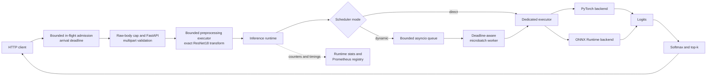
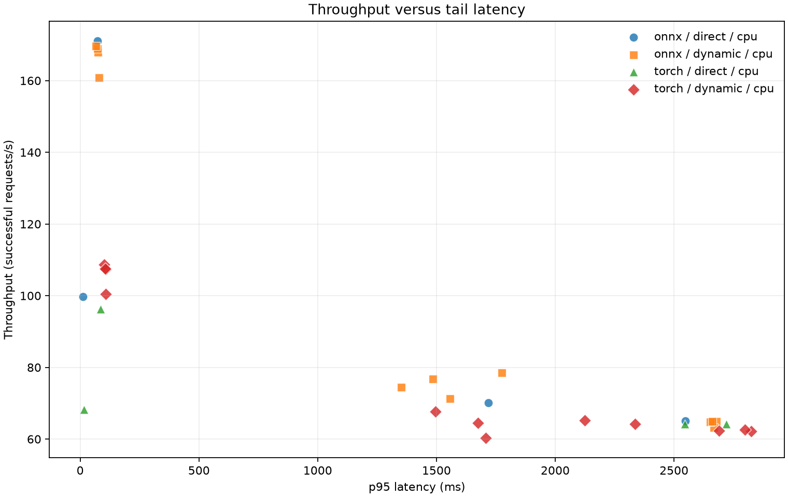
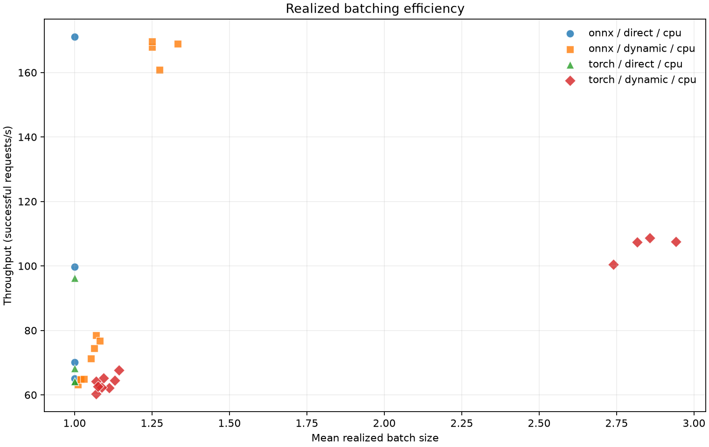

# Adaptive Inference Gateway

[](https://github.com/Sahil-Arifi/adaptive-inference-gateway/actions/workflows/ci.yml)

Adaptive Inference Gateway is a production-style ImageNet inference runtime built to make one
systems trade-off measurable: larger batches can increase compute efficiency, but waiting to form
those batches adds queueing latency. The project serves an ordinary pretrained ResNet18 so the
engineering focus stays on admission control, asynchronous scheduling, backend execution,
observability, and reproducible experiments—not model training.

This is an educational single-node implementation, not a replacement for NVIDIA Triton or another
managed production inference platform.

## Why dynamic batching exists

An accelerator or vectorized CPU kernel can often process a batch more efficiently than the same
items submitted one at a time. An online server does not receive a ready-made batch, though; it sees
independent requests arriving at different times. A dynamic batcher briefly holds compatible work,
then issues one physical backend call for several logical requests.

That creates a deliberate tension:

- A larger `max_batch_size` gives the runtime more opportunity to amortize backend overhead.
- A larger `max_wait_ms` gives a batch more time to fill.
- Both can increase time spent in the queue, especially at low traffic.
- A bounded queue and per-request deadline prevent the search for throughput from consuming
  unlimited memory or returning results after callers no longer care.

The benchmark measures both throughput and tail latency. It never assumes batching helps or ONNX is
faster.

## Architecture



The HTTP event loop never runs PyTorch or ONNX inference directly. Both backends expose the same
synchronous NumPy contract, while a dedicated `ThreadPoolExecutor` isolates their blocking work.
HTTP handlers know nothing about backend-specific tensors, sessions, or providers.

### Request lifecycle

1. An outer ASGI layer acquires one of `max_in_flight_requests` non-blockingly and stamps an
   absolute monotonic deadline at request arrival. Exhausted admission returns HTTP 429 before the
   body is read.
2. A streaming raw-body limit runs before multipart parsing. FastAPI then accepts only multipart
   JPEG or PNG uploads and enforces the exact `max_upload_bytes` file limit.
3. A separately bounded executor decodes the image, rejects unsafe dimensions or malformed and
   unsupported formats, converts it to RGB, and applies `ResNet18_Weights.DEFAULT.transforms()` to
   produce a contiguous `[3, 224, 224]` float32 tensor.
4. The original arrival deadline follows the request through preprocessing and scheduler
   admission; a stalled upload, transform, or inference request returns HTTP 504.
5. Direct mode executes `[1, 3, 224, 224]` through a bounded set of admitted backend tasks. Dynamic
   mode admits with
   `put_nowait`; a full queue fails immediately with HTTP 429.
6. The dynamic worker collects compatible shapes until the batch is full, its collection window
   expires, or the earliest request deadline requires a flush. It stacks once and makes exactly one
   backend call.
7. Output rows are mapped to their original Futures in request order. Cancelled or expired callers
   are safely discarded without corrupting the rest of the batch.
8. Softmax is applied after logits return, and the API emits ImageNet labels plus scheduler timing
   metadata.

The runtime has distinct, explicit bounds for whole HTTP requests, decoded-image preprocessing,
and scheduler admission. The dynamic queue bound covers waiting requests; one active batch can
exist outside that queue. A caller timeout does not release direct-mode capacity until its physical
backend task exits. Shutdown first stops admission, settles both collecting and queued Futures,
joins in-flight native work, and closes the backend without leaving unresolved Futures.

### Scheduler algorithm

For the first active request, the worker computes a flush boundary from both
`enqueued_at + max_wait_ms` and the earliest absolute deadline. It drains immediately available,
shape-compatible requests, then awaits another request only for the remaining window. Expired and
cancelled entries are pruned before stacking and checked again before fan-out. A backend exception
settles every member of that batch and the worker remains available for later work.

The concepts parallel production systems: Triton also exposes maximum batch size and a bounded
queue-delay control for dynamic batching. This repository intentionally omits Triton's multi-model,
distributed, accelerator-management, and production-support surface; see NVIDIA's
[dynamic batcher documentation](https://docs.nvidia.com/deeplearning/triton-inference-server/archives/triton-inference-server-2591/user-guide/docs/user_guide/batcher.html).

## Backends and model artifacts

All backends implement:

```python
class InferenceBackend(Protocol):
    @property
    def name(self) -> str: ...
    @property
    def device(self) -> str: ...
    def predict_logits(self, batch: np.ndarray) -> np.ndarray: ...
    def warmup(self) -> None: ...
    def close(self) -> None: ...
```

- `TorchBackend` loads `resnet18(weights=ResNet18_Weights.DEFAULT)`, calls `eval()`, and supports
  `cpu`, `cuda`, and `auto`.
- `OnnxBackend` always supports `CPUExecutionProvider`; `CUDAExecutionProvider` is accepted when an
  optional GPU runtime is installed.
- `FakeBackend` is deterministic and records physical calls/batch sizes for offline tests.

`inference-gateway export` uses the modern `torch.onnx.export(..., dynamo=True)` path with a
`torch.export.Dim` batch axis. It runs `onnx.checker`, loads the artifact with ONNX Runtime, and
executes real batches of 1, 4, and 16. `inference-gateway parity` feeds exact deterministic tensors
to both runtimes, measures maximum/mean absolute logit error and top-1 agreement, and writes a
SHA-256-bound `artifacts/parity.json`. The benchmark rejects a failed, stale, or policy-mismatched
file: the evidence must identify ResNet18, `[3, 224, 224]`, batches 1/4/16, 1000 logits per image,
`rtol=1e-4`, `atol=1e-5`, and the configured benchmark device.

Weights and `artifacts/resnet18.onnx` are generated locally and ignored by Git.

## Quick start

Prerequisites: Python 3.11 or newer and [uv](https://docs.astral.sh/uv/).

```bash
git clone https://github.com/Sahil-Arifi/adaptive-inference-gateway.git
cd adaptive-inference-gateway
uv sync --frozen

uv run inference-gateway export --config configs/default.yaml
uv run inference-gateway parity --config configs/default.yaml
uv run inference-gateway serve --config configs/default.yaml
```

The first export downloads the public torchvision checkpoint into the user's normal Torch cache.
The default lock selects CPU-only Torch wheels on Windows and Linux; CUDA is not required by CI.

From another terminal:

```bash
uv run inference-gateway make-demo-image artifacts/demo.png
uv run python scripts/demo_client.py artifacts/demo.png

uv run inference-gateway loadtest \
  --url http://127.0.0.1:8000 \
  --requests 200 \
  --concurrency 32
```

The CLI includes detailed command help:

```bash
uv run inference-gateway --help
uv run inference-gateway benchmark --help
```

### Optional CUDA path

CUDA is deliberately outside the frozen CPU environment. On a compatible machine, install matching
CUDA Torch wheels and `onnxruntime-gpu` in a separate environment, select `device: cuda`, and write
GPU results to a separate output directory. Never combine CPU and GPU rows without their device
labels.

## HTTP API

| Endpoint | Purpose |
|---|---|
| `GET /healthz` | Process liveness only |
| `GET /readyz` | Ready after backend load, warmup, and scheduler startup |
| `POST /v1/predict` | Multipart JPEG/PNG inference (`file` field) |
| `GET /stats` | Cumulative queue, batch, backend-call, outcome, and uptime statistics |
| `GET /metrics` | Prometheus text exposition |

Successful predictions include the request ID, top class/index/confidence, configured top-k list,
backend, resolved device, scheduler mode, server processing time, queue wait, backend duration, and
realized batch size. Expected overload and validation responses are explicit:

| Status | Meaning |
|---:|---|
| 413 | Upload exceeds the configured byte limit |
| 415 | Unsupported media type or decoded image format |
| 422 | Missing or malformed image |
| 429 | In-flight, preprocessing, or scheduler capacity is full; admission is rejected immediately |
| 503 | Runtime is starting or shutting down |
| 504 | Absolute request deadline expired |

Internal exceptions are logged without image contents and returned as a sanitized 500 response.

## Configuration

`configs/default.yaml` is the normal server configuration. `configs/benchmark.yaml` fixes execution
to CPU and uses a longer timeout for saturated cases. `max_in_flight_requests` bounds upload parsing
through response completion; `max_preprocessing_queue_size` bounds running and waiting transforms;
and `scheduler.max_queue_size` bounds scheduler admission. Configuration is validated with Pydantic
before startup. Unknown keys, invalid timing relationships, capacities below benchmark concurrency,
and any primary grid other than the exact documented 32 coordinates fail closed.

## Observability

`/stats` exposes runtime-work counters: scheduler-accepted, completed, cancelled, and backend-failed
logical requests, plus capacity rejections and end-to-end deadline expirations from any request
stage. A disconnect before scheduler admission is released safely but is not counted as an accepted
or scheduler-cancelled request. The endpoint also reports backend calls and executed batches,
current/maximum scheduler queue depth, realized batch-size statistics, mean queue/backend time,
backend/device/mode, and uptime.

Prometheus collectors are the all-HTTP view: they cover prediction request/failure/rejection counts,
end-to-end request latency (including upload parsing and preprocessing), scheduler queue depth and
wait, backend duration, batch size, and backend call count. Each app instance owns an isolated
registry, and no metric accepts request IDs or other unbounded labels.

## Reproducible benchmark

The load generator creates a fixed alternating JPEG/PNG sequence from NumPy and Pillow and uses one
`httpx.AsyncClient` with bounded concurrent workers. Warmups are excluded. Every measured request is
timed with `time.perf_counter()`, and p50/p95/p99 are calculated from individual successful request
durations—not averages of averages.

The primary CPU matrix contains exactly 32 cases:

- Family A — 8 direct baselines: PyTorch and ONNX at concurrency 1, 8, 32, and 64.
- Family B — 24 dynamic cases: both backends, batch sizes 8 and 16, waits 1 ms and 3 ms, and
  concurrency 8, 32, and 64.

Ten real loopback server groups avoid repeatedly loading the same backend/scheduler configuration.
Each Uvicorn server runs in a spawned child process with its own event loop, so blocking inference
cannot starve the load generator's client loop. Each case captures a before/after server-stat delta
as well as raw client samples. Run everything and regenerate every derived artifact with:

```bash
uv run inference-gateway benchmark --config configs/benchmark.yaml
uv run inference-gateway report --results artifacts/results.json
```

Generated, reviewable artifacts are:

- `artifacts/parity.json`
- `artifacts/results.json` (canonical full precision, raw samples, and canonical provenance hashes)
- `artifacts/results.csv`
- `artifacts/report.md`
- `artifacts/throughput_vs_p95.png`
- `artifacts/batch_efficiency.png`

The CSV, Markdown report, charts, and marked section below are generated from `results.json`; no
benchmark number is typed into the report by hand. Report generation first validates the exact
32-case matrix, finite raw samples and aggregate/count invariants, full config and parity policy, and
canonical SHA-256 provenance. Invalid or partial JSON cannot update the README.

<!-- BENCHMARK_RESULTS_START -->
## Measured benchmark results

This benchmark completed 32 primary cases on the environment recorded in `artifacts/results.json`.

Measured environment:

- Operating system: `Windows-10-10.0.26200-SP0`
- Machine: `AMD64`
- Processor: `AMD64 Family 26 Model 68 Stepping 0, AuthenticAMD`
- Logical CPUs: `16`
- Python: `3.11.16`

- Best throughput: `onnx-direct-c8` — 171.033 req/s on `cpu`
- Best p95 latency: `onnx-direct-c1` — 11.403 ms on `cpu`





See [`artifacts/report.md`](artifacts/report.md) for the full generated table and methodology.
<!-- BENCHMARK_RESULTS_END -->

## Repeated concurrency diagnostics

The original published matrix is a single CPU run. Its high-concurrency throughput
drop is an observation, not a diagnosed root cause. A separate command now runs a
longer, randomized concurrency sweep against an explicitly running server:

```bash
uv run inference-gateway diagnose --url http://127.0.0.1:8000 \
  --concurrency 1,8,32,64 --repetitions 5 --requests 2000 \
  --warmup-requests 100 --seed 2027 --output artifacts/diagnostics-onnx-direct
```

Start the desired backend/scheduler configuration with `serve` first. Run the client
on a separate host when investigating client/server contention. The output directory
must be new. The command saves its plan, every completed trial's raw samples and
before/after server statistics, and a summary of whole-trial means, standard deviations,
and ranges. Trial order is shuffled within each repetition from the recorded seed.
Backend, device, and scheduler identity must remain consistent throughout the sweep.

Successful HTTP responses now expose `upload_and_parse_ms` (arrival through file read),
`preprocessing_ms` (executor waiting plus image transformation), and `server_processing_ms`
(arrival through prediction construction). The load generator preserves these alongside
queue and backend timings. This makes it possible to see whether delay accumulates before
or after scheduler admission. Client time minus server time is a residual that includes
transport, response processing, and timing boundary differences; it is not pure network
latency. Missing or invalid timing telemetry remains unknown instead of becoming zero.

These diagnostics use closed-loop concurrent workers, not a fixed arrival-rate workload.
Tail percentiles cover successful requests; failures remain separately recorded in each
trial. Standard deviations describe trial variation, not confidence intervals. This feature
does not overwrite the canonical 32-case benchmark, and no new measured speedup or root
cause is claimed without a fresh run.

## Docker

The CPU image installs the frozen production dependency group, runs as an unprivileged `gateway`
user, exposes port 8000, and includes a liveness healthcheck. Model files stay in a named volume:

```bash
docker build -t adaptive-inference-gateway .
docker volume create adaptive-inference-artifacts

docker run --rm \
  -v adaptive-inference-artifacts:/app/artifacts \
  adaptive-inference-gateway \
  inference-gateway export --config configs/default.yaml

docker run --rm \
  -v adaptive-inference-artifacts:/app/artifacts \
  adaptive-inference-gateway \
  inference-gateway parity --config configs/default.yaml

docker run --rm -p 8000:8000 \
  -v adaptive-inference-artifacts:/app/artifacts \
  adaptive-inference-gateway
```

Then run the host-side demo commands from Quick start. No credentials are copied into the image.

## Tests and CI

The test suite is offline: it uses deterministic tensors, synthetic images, `FakeBackend`, and small
locally initialized Torch models for ONNX behavior. It never asks torchvision for pretrained
weights. Coverage includes preprocessing, backend contracts, dynamic export/parity, batching and
mapping, capacity/deadlines/cancellation, clean shutdown, HTTP load shedding, metrics, load-generator
math, the 32-case matrix, serialization, reports, and chart generation.

```bash
uv lock --check
uv sync --frozen
uv run ruff check .
uv run mypy src
uv run pytest
```

Pytest enforces at least 85% branch-aware coverage. GitHub Actions runs the frozen CPU environment on
Ubuntu and Windows with Python 3.11 and does not download production model weights.

## Repository structure

```text
adaptive-inference-gateway/
├── configs/                 # Validated server and benchmark configurations
├── docker/                  # POSIX container entrypoint
├── scripts/demo_client.py   # One-image HTTP demo
├── src/inference_gateway/
│   ├── backends/            # Protocol, PyTorch, ONNX Runtime, deterministic fake
│   ├── preprocessing.py     # Pillow decode and exact torchvision transform
│   ├── exporting.py         # Dynamo ONNX export, checker, dynamic-batch validation
│   ├── parity.py            # Numerical and artifact-identity gate
│   ├── queueing.py          # Pending request and bounded queue primitives
│   ├── scheduler.py         # Direct and dynamic scheduling policies
│   ├── runtime.py           # Executor, lifecycle, and cumulative statistics
│   ├── service.py           # Thin FastAPI transport layer
│   ├── metrics.py           # Isolated Prometheus registry
│   ├── loadgen.py           # Deterministic concurrent HTTP traffic
│   ├── benchmark.py         # 32-case real-server orchestration
│   ├── reporting.py         # Data-derived JSON/CSV/Markdown/PNG artifacts
│   └── cli.py               # Installed `inference-gateway` commands
└── tests/                   # Offline unit and integration tests
```

## Engineering decisions

- The backend contract is synchronous because both runtimes block; async safety belongs in the
  runtime executor, not backend implementations.
- Deadlines are absolute monotonic timestamps so time already spent waiting is never reset.
- HTTP, preprocessing, and scheduler admission are all bounded and non-blocking. Overload is made
  visible as 429 instead of moving an unbounded wait into another layer.
- Parity evidence includes the ONNX SHA-256, preventing benchmarks from trusting results for a
  different artifact.
- Per-response queue/backend/batch telemetry makes benchmark rows measurable without inferring
  server behavior from client latency alone.
- The production lock is CPU-only for deterministic Windows/Linux CI; CUDA remains an explicit,
  separately labeled runtime path.

## Limitations and future work

- One process owns one model and one dynamic batch worker; there is no distributed admission or
  multi-model scheduling.
- An in-flight native backend call cannot be preempted. A timed-out row is discarded safely after
  the physical call returns.
- Synthetic images isolate serving behavior but say nothing about ImageNet accuracy.
- Loopback benchmarks include client/server contention on the same host and should not be compared
  to numbers from different hardware as if they were one experiment.
- Authentication, TLS termination, model-version rollout, autoscaling, and persistent tracing are
  deployment concerns outside this educational runtime.

The strongest next improvement is an explicit priority/deadline policy with multiple independently
measured batch workers, allowing the same benchmark harness to quantify fairness and head-of-line
blocking under mixed service-level objectives.
